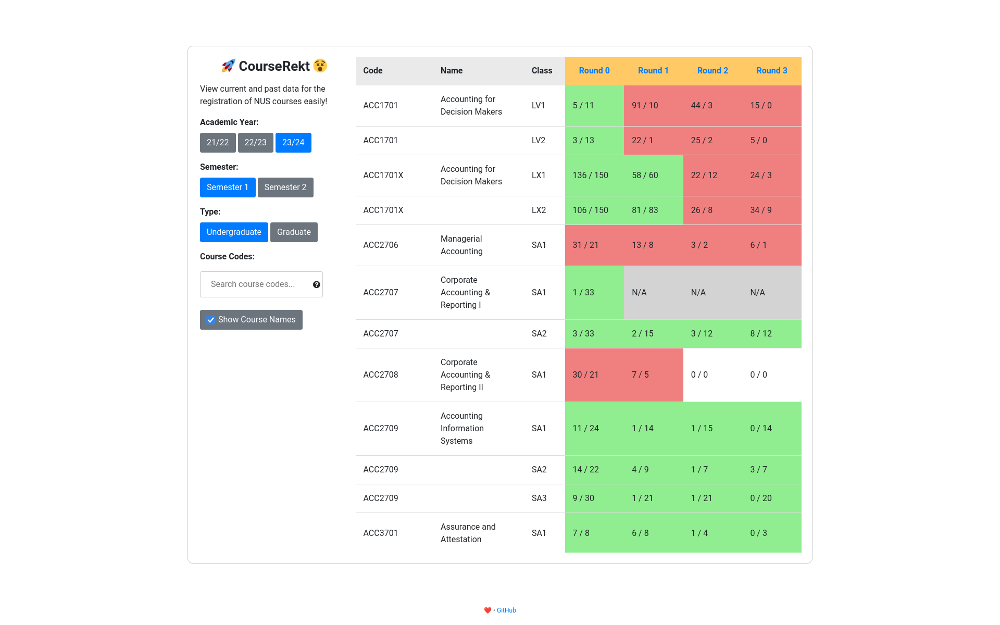

# :rocket: CourseRekt
## [Visit the website here!](https://courserekt.vercel.app/) :computer:

## Purpose

It is rather unfortunate that NUS does not keep a record of the Demand Allocation Reports. Furthermore, the data is presented in such a verbose and hard-to-visualise way. This app aims to streamline this process, making analysis of a course's past popularity more accessible and straightforward.

The site harmonises the data from Vacancy Reports as well as Demand Allocation Reports to provide the best-known information about a course at any time. Demand Allocation Reports, while they represent a lot of information, is not the full picture. Some courses are omitted from the demand allocation reports if there are no available seats, or if nobody registered for them, or are just deemed unimportant. This is where we use the Vacancy Reports to back our information up.

## For Users:

### Search Bar

You can delimit your search with spaces. For example, "AC5001 CS2" will show all course codes that have "AC5001" or "CS2" in its name.

### Accessing the PDF data

You can click the column headers to access the raw PDF data used to generate the table for the respective year, semester, and undergraduate/graduate type.

### Interpreting table cells

Each cell corresponds to the data in the PDF for the course's class and round number, in the format `x / y`.

`x` is the `Demand` and `y` is the `Vacancy` as per the CourseReg PDF, i.e., `x` people are vying for `y` slots.

- If `y` is displayed as `∞`, the `Vacancy` in the CourseReg PDF is `-`.
- If `N/A` is displayed, the class data was neither found in the Vacancy PDF nor the CourseReg PDF.

## Contributing

Please refer to `CONTRIBUTING.md` for more information.

Feel free to fork the project, make some changes, and submit a pull request. If you find any bugs or have any suggestions, please open an issue. All contributions are welcomed!

## Contributors

Thank you to all of our contributors!

Made with [contrib.rocks](https://contrib.rocks).
